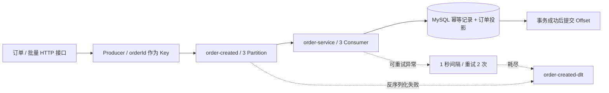

# Kafka Order Event Demo

**基于 Spring Boot、Kafka 与 MySQL 的订单事件学习项目。** 从异步事件发送，到消费组与 Offset、持久化幂等、失败隔离，再到 Producer 故障与消费积压实验，展示 Java 后端消息处理的实现与验证思路。

技术栈：Java 21 · Spring Boot 3.5.13 · Spring Kafka · JDBC / Spring Transaction · MySQL 8.4 · Kafka 4.2.1（KRaft 单节点）· Kafbat UI · Docker Compose。

## 核心能力

| 能力 | 真实代码中的实现 |
| --- | --- |
| Topic / Partition / Group / Offset | `order-created` 有 3 个 Partition，`order-service` 消费组使用 3 个并发 Consumer；日志记录线程、分区、当前及下一 Offset |
| 业务持久化幂等 | MySQL 对消费组 + 事件类型 + 业务键建立唯一约束，同时约束同组的 Topic + Partition + Offset；重复记录跳过业务 |
| 事务回滚 | 幂等登记与 `order_projection` 写入在同一 `@Transactional` 方法内；业务失败回滚，成功返回后手动提交 Offset |
| Retry / DLT | `DefaultErrorHandler` 对可重试业务异常采用 1 秒间隔、2 次重试（含首次共 3 次），耗尽后发送到 3 分区 `order-created-dlt` |
| 反序列化异常 | `ErrorHandlingDeserializer` 捕获非法消息；`DelegatingByTypeSerializer` 支持事件对象与原始 `byte[]`，用于 DLT 投递 |
| Producer 可靠性实验 | `enable.idempotence=true`、`acks=all`、最多 5 个在途请求、30 秒请求超时、120 秒投递期限；异步回调记录最终发送结果 |
| 积压与并行实验 | 批量接口一次发送 1～500 条，可配置消费延迟制造 Lag；观察 3 Partition × 3 Consumer 的分配与积压消退 |



## 快速启动

准备 JDK 21、Maven 3.9+ 与 Docker Compose，在仓库根目录执行：

```powershell
Copy-Item .env.example .env
# 编辑 .env，替换示例密码。
docker compose up -d
mvn clean package
java -jar target/kafka-demo-0.0.1-SNAPSHOT.jar
```

Linux/macOS 使用 `cp .env.example .env`。Compose 与应用共同读取 `.env`，保持简单的 `KEY=value` 格式，不加 shell 引号或 `export`。应用不再自动启停 Compose，请显式管理容器；首次运行等待 MySQL / Kafka 健康检查通过后启动应用。

应用端口 **8090**，Kafka **9092**，MySQL **3308**，Kafbat UI **8080**，映射端口仅绑定本机。启动时 [schema.sql](src/main/resources/schema.sql) 创建表，`KafkaAdmin` 声明 Topic。已有数据保留；修改 `.env` 不会改变已有 MySQL 卷中的密码。

```powershell
Invoke-RestMethod -Method Post -Uri http://localhost:8090/api/kafka/orders -ContentType application/json -Body '{"orderId":10001,"userId":20001,"amount":99.90}'
Invoke-RestMethod -Method Post -Uri 'http://localhost:8090/api/kafka/orders/batch?count=60&startOrderId=90000'
```

HTTP 响应表示请求已提交给 Producer；Broker 接收结果以异步回调为准，业务结果再查 MySQL。

发送回调超时也不代表消息一定没有写入：本次 Broker Pause 实验出现过客户端超时后，Broker 恢复仍完成消费的情况，业务重发仍需幂等。

## 故障实验入口

| 实验 | 操作与观察点 |
| --- | --- |
| 重复业务事件 | 重复发送同一个 `orderId`；订单投影与业务幂等记录各一条 |
| 事务回滚与 Retry / DLT | 发送 `userId=null`，触发数据库非空约束异常；观察 3 次尝试、两张表均无该订单记录、消息进入 DLT |
| 非法 JSON | 通过 console producer 写入非法 JSON；观察原始字节进入 DLT，后续合法消息继续消费 |
| `acks=all` 与 ISR | `POST /api/kafka/producer/reliability-test`；比较单副本与 `min.insync.replicas=2` 的行为。本次 Kafka 4.2.1 KRaft 实测仍发送成功，不能把该配置写成必然失败的实验 |
| Broker Pause | 暂停 Broker 后发送、等待后恢复；比较投递期限内恢复与最终超时，查看异步回调，详见实验手册 |
| Consumer Lag | 启动时加 `--demo.kafka.consumer.processing-delay-ms=1000` 后批量发送；用消费组命令查看 LAG 增长与消退 |
| 3 × 3 并行 | 查看消费日志里的 3 个线程及 3 个 Partition 分配；有效并行度受分区数限制 |

完整命令与预期结果见 [实验与源码手册](docs/README.md)。实验入口和预期行为来自代码；历史提交说明不代替本次实测，也不声称测得固定吞吐量或线性三倍性能。

## 保证范围与边界

MySQL 本地事务不包含 Kafka Offset；数据库提交后、Offset 提交前崩溃仍会重投，靠持久化幂等避免重复业务。Producer Idempotence 主要约束客户端发送重试导致的重复，用户重新发起相同业务请求仍需业务幂等。

这是单 Broker、单副本学习环境，`acks=all` 不代表已具备多副本容灾。反序列化异常属于错误处理器默认不可重试异常，不能写成“所有异常都会重试 3 次”。当前 DLT 没有业务重放/人工处置流程，Producer 最终失败只记录日志，没有数据库 Outbox 或自动补偿；尚未实现 Kafka 事务、端到端 Exactly Once 与生产监控告警。

## 源码导航

- [接口与批量实验](src/main/java/com/example/controller/KafkaDemoController.java)
- [Producer 与异步结果](src/main/java/com/example/producer/OrderEventProducer.java) · [序列化配置](src/main/java/com/example/config/KafkaProducerConfig.java)
- [Consumer 与 Offset](src/main/java/com/example/consumer/OrderEventConsumer.java) · [幂等事务](src/main/java/com/example/service/OrderCreatedEventService.java)
- [Retry / DLT 配置](src/main/java/com/example/config/KafkaConsumerConfig.java) · [Topic 配置](src/main/java/com/example/config/KafkaTopicConfig.java)

求职介绍可概括为：实现 Spring Boot + Kafka + MySQL 订单事件 Demo，通过唯一约束与本地事务保障消费幂等，配置 Retry/DLT 与反序列化异常隔离，并提供 Producer 可靠性、Broker Pause、Consumer Lag 和三分区并行消费实验。
